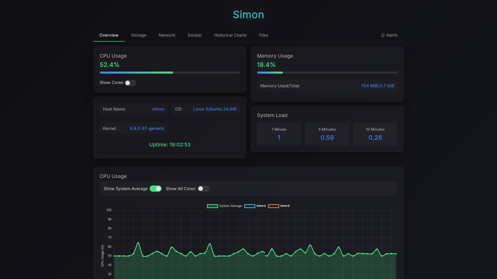
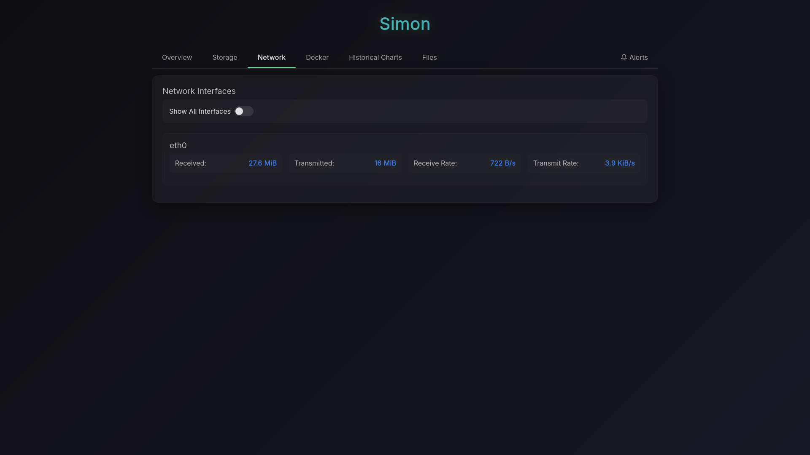
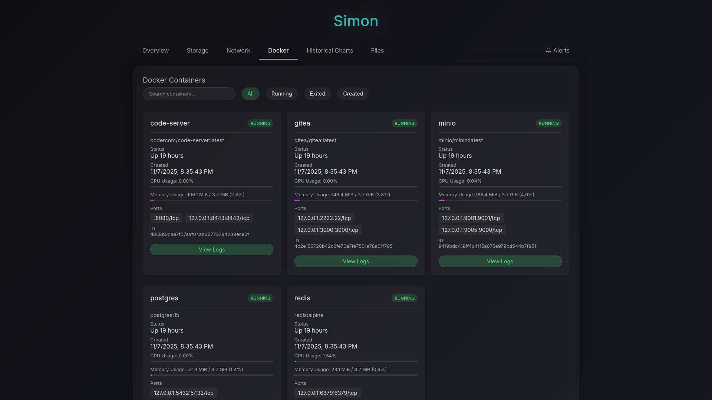
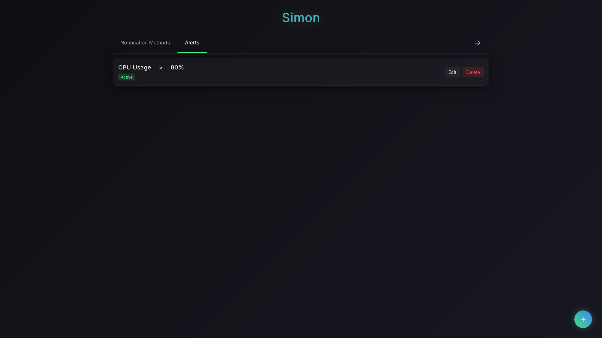

# Simon
<p align="center">
  
</p>

<p align="center">
<a href="https://github.com/alibahmanyar/simon/releases"></a>
<a href="https://github.com/alibahmanyar/simon/actions"></a>
<a href="https://hub.docker.com/r/alibahmanyar/simon"></a>
<a href="https://github.com/alibahmanyar/simon/blob/main/LICENSE"></a>
</p>


<p align="center">
<strong>A lightweight, all-in-one system monitor with Docker support, live metrics, alerts, and a built-in file browser.</strong>
<br />
It's a single, dependency-free binary written in Rust, designed for resource-constrained environments like embedded Linux systems.
</p>

---

## Demo

<p align="center">
  
  <br>
  <em>Real-time monitoring, Docker integration, file browsing, and alert management - all in one interface</em>
  <br><br>
  <a href="docs/SCREENSHOTS.md"><strong>View All Screenshots</strong></a>
</p>

---

## Table of Contents

- [Features](#features)
- [Quick Start](#quick-start)
- [Documentation](#documentation)
- [Building from Source](#building-from-source)
- [Gallery](#gallery)
- [License](#license)
- [Acknowledgments](#acknowledgments)


## Features

### 🪶 Lightweight
- **Written in Rust:** For a memory-safe, high-performance core
- **Single Binary:** A self-contained executable with no external dependencies to install or manage
- **Minimal resource footprint** - Perfect for embedded systems and low-power devices

### 📊 System Monitoring
- **Real-time metrics** - Live tracking of CPU, memory, disk usage, disk I/O, and network activity
- **Historical data** - Visualize trends with interactive charts
- **Cross-platform** - Runs on Linux, Windows, Android, and FreeBSD
- **Multi-architecture** - Native support for x86_64, i686, aarch64, and armv7

### 🐳 Docker Integration
- **Container monitoring** - Track resource usage for all running containers
- **Log viewer** - Access and search container logs directly from the web interface
- **Real-time stats** - Per-container CPU and memory metrics

### 📁 File Browser
- **Filesystem navigation** - Browse and explore directories through the web UI
- **File viewer** - Preview file contents directly in your browser
- **File downloads** - Secure file download capability

### 🔔 Alerting System
- **Flexible alerts** - Set custom thresholds for CPU, memory, disk, and network
- **Multiple channels** - Send notifications via Telegram, ntfy, or custom webhooks
- **Templates** - Pre-configured notification templates for quick setup


## Quick Start

### Option 1: Prebuilt Binary

Download the latest release for your platform from the [Releases](https://github.com/alibahmanyar/simon/releases) page and run:

```bash
chmod +x simon
./simon
```

The web interface will be available at `http://localhost:30000`

### Option 2: Docker

```bash
docker run -d \
  --name simon \
  -p 30000:30000 \
  -v /sys:/sys:ro \
  -v /var/run/docker.sock:/var/run/docker.sock:ro \
  -v /:/fs:ro \
  -v ./simon-data:/app/simon-data \
  alibahmanyar/simon
```

### Option 3: Docker Compose

```yaml
services:
  simon:
    image: alibahmanyar/simon
    hostname: simon
    ports:
      - "30000:30000"
    environment:
      SIMON_PASSWORD_HASH: "$$2a$$12$$nmCGsgJ3ovx76sc/J8Bcs.Vn235KLQK7Cze83Kzm36a1v59QKVOO."
    volumes:
      - /sys:/sys:ro
      - /var/run/docker.sock:/var/run/docker.sock:ro
      - /:/fs:ro
      - ./simon-data:/app/simon-data
```

Run with: `docker-compose up -d`

> **Note:** The default password for the example hash is `secret`. See [Authentication](docs/SETUP.md#authentication) for instructions on generating your own secure hash.

---

## Documentation

Comprehensive documentation is available in the `docs/` directory:

- **[Setup Guide](docs/SETUP.md)** - Installation methods, Docker configuration, reverse proxy setup, and authentication
- **[Configuration Reference](docs/CONFIGURATION.md)** - Complete list of configuration options and environment variables
- **[Alerts and Notifications](docs/ALERTS.md)** - Setting up alerts, notification methods, and notification templates

### Key Configuration Options

| Option | Environment Variable | Default | Description |
|--------|---------------------|---------|-------------|
| Port | `SIMON_PORT` | `30000` | Server port |
| Update Interval | `SIMON_UPDATE_INTERVAL` | `2` | Metrics refresh interval (seconds) |
| Password Hash | `SIMON_PASSWORD_HASH` | None | Bcrypt hash for authentication |
| Database Path | `SIMON_DB_PATH` | `./simon-data/simon.db` | SQLite database location |
| Serve Directories | `SIMON_SERVE_DIRS` | None | Comma-separated paths for file browser |

See the [Configuration Reference](docs/CONFIGURATION.md) for all available options.


## Building from Source

Simon consists of a Rust backend and a Svelte-based web frontend.

### Prerequisites

- [Rust toolchain](https://rustup.rs/) (latest stable)
- [Bun](https://bun.sh/docs/installation) (for building the web frontend)

### Build Steps

```bash
# Clone the repository
git clone https://github.com/alibahmanyar/simon.git
cd simon

# Setup and build web frontend
make web-setup
make web

# Build Simon
make release
```

---

## Gallery

<p align="center">
  
  
  <br>
  
  
</p>

<p align="center">
  <a href="docs/SCREENSHOTS.md"><strong>View All Screenshots →</strong></a>
</p>

---

## License

This project is licensed under the MIT License - see the [LICENSE](LICENSE) file for details.

## Contributing

Contributions are welcome! Please feel free to submit issues, feature requests, or pull requests.

## Acknowledgments

Simon is built on top of excellent open-source projects:

**Backend (Rust)**
- [axum](https://github.com/tokio-rs/axum) - Web framework
- [sysinfo](https://github.com/GuillaumeGomez/sysinfo) - System information
- [bollard](https://github.com/fussybeaver/bollard) - Docker API client
- [tokio](https://tokio.rs/) - Async runtime
- [rusqlite](https://github.com/rusqlite/rusqlite) - SQLite interface

**Frontend**
- [Svelte](https://svelte.dev/) - UI framework
- [SvelteKit](https://kit.svelte.dev/) - Application framework
- [Chart.js](https://www.chartjs.org/) - Data visualization
- [Bun](https://bun.sh/) - Build tooling

Thank you to all the contributors and maintainers of these projects!

---

**Happy Monitoring!**
