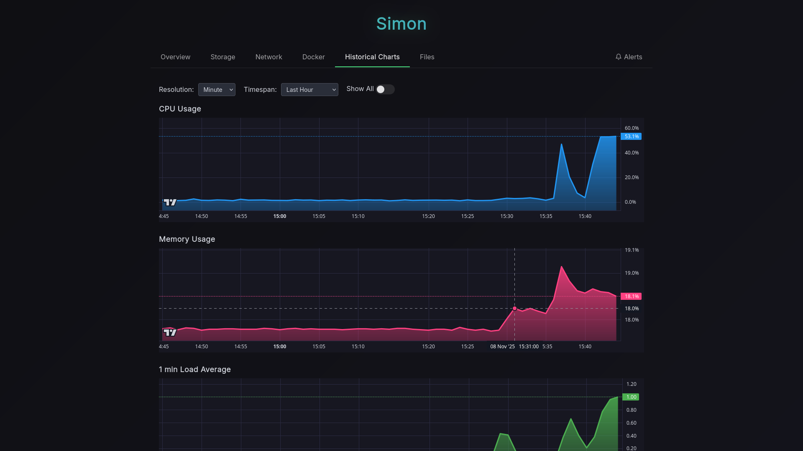
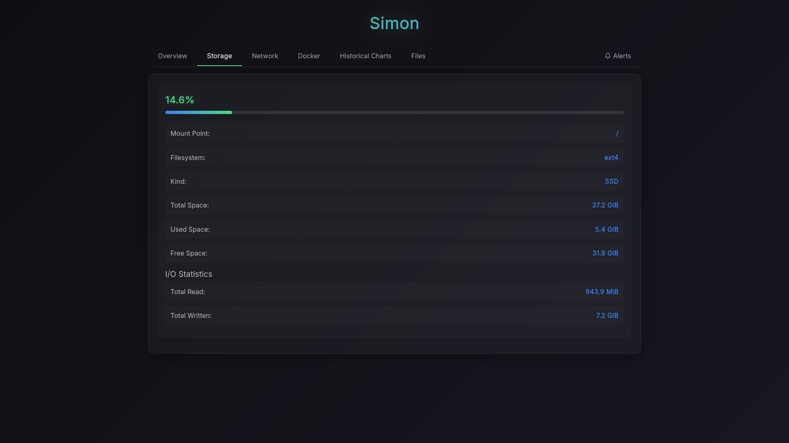
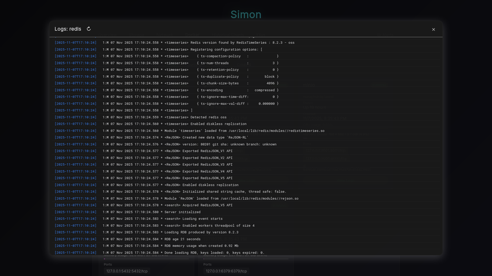
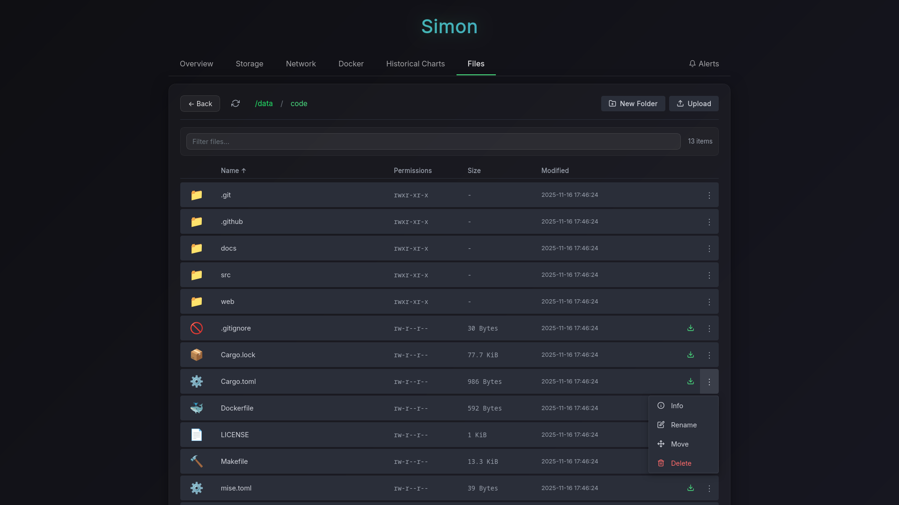
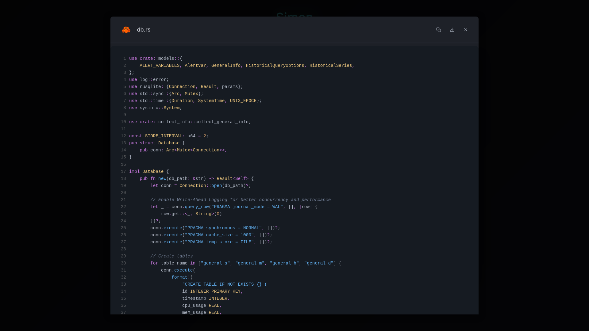
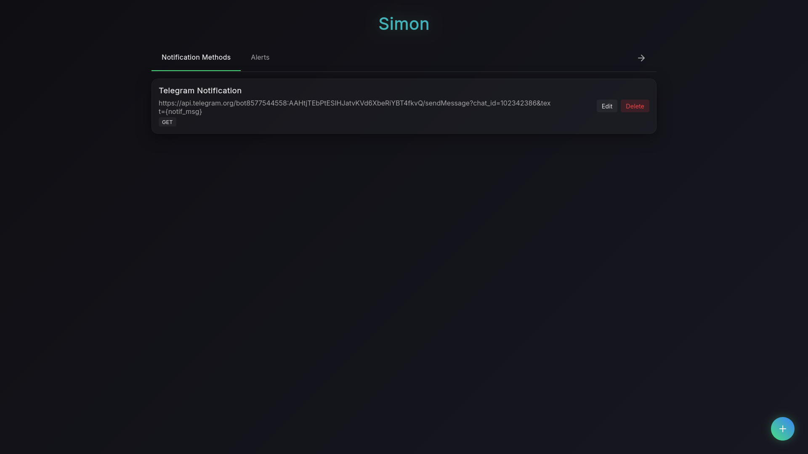
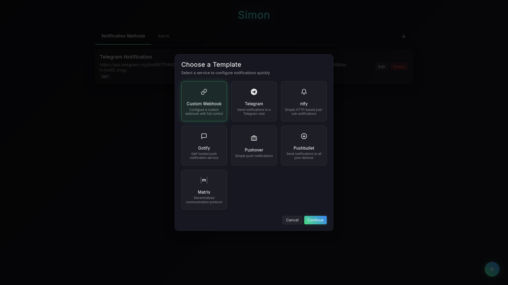
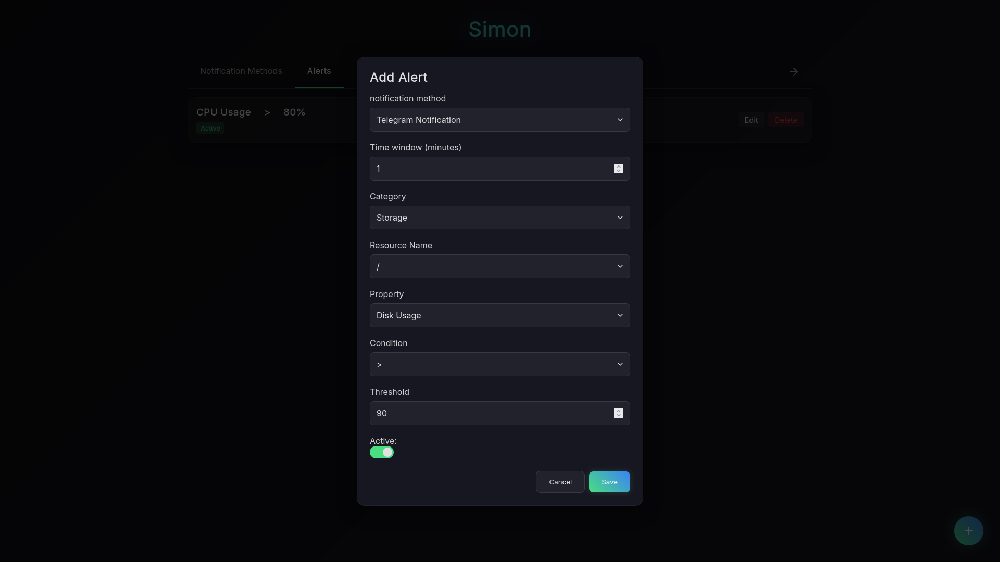
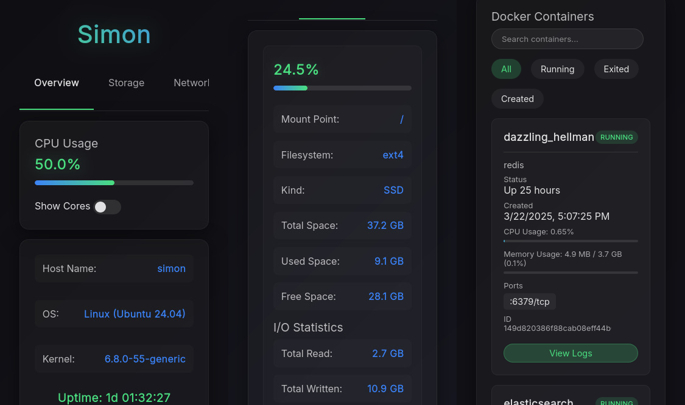
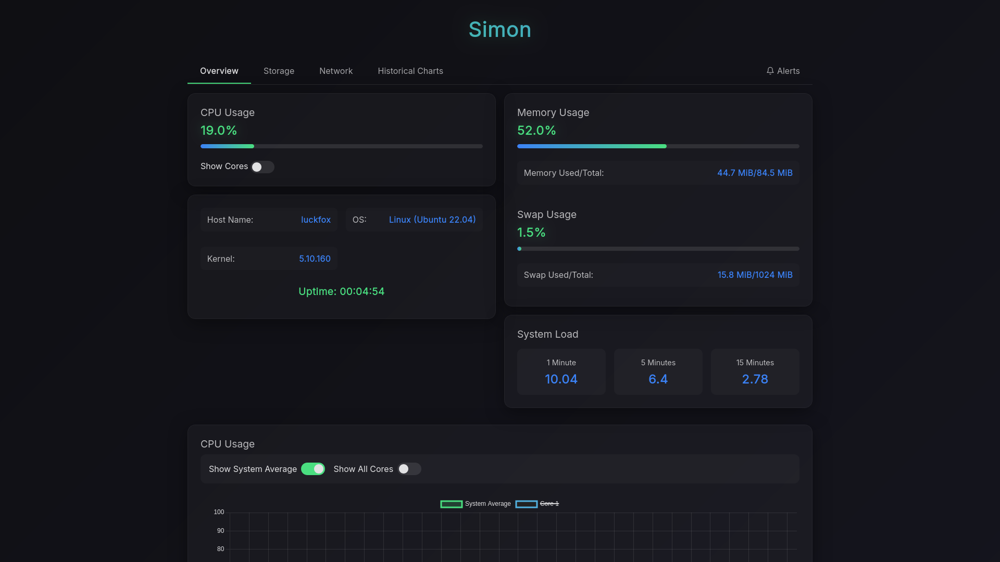

# Screenshots & Demo

## Demo Video

https://github.com/user-attachments/assets/c8de7765-db7d-49cd-8182-54b91091d01c

---

## Dashboard & Monitoring

### System Overview

  
   <em>Real-time system metrics overview with CPU, memory, and resource monitoring</em>

### Historical Charts

  
   <em>Historical data visualization</em>

### Storage Information

  
   <em>Storage and filesystem monitoring with disk usage statistics</em>

### Network Statistics

  
   <em>Network interface statistics and real-time throughput monitoring</em>

---

## Docker Integration

### Container Monitoring

  
   <em>Container resource monitoring for all running containers</em>

### Container Logs

  
   <em>Container log viewer</em>

---

## File Browser

### Directory Navigation

  
   <em>Browse and explore directories</em>

### File Preview

  
   <em>Preview file contents directly in browser with syntax highlighting</em>

---

## Alerts & Notifications

### Notification Methods List

  

### Adding Notification Method

  
   <em>Setup with templates for Telegram, ntfy, ... or configure a webhook manually </em>

### Alerts List

  

### Alert Configuration

  
   <em>Create custom alert rules with flexible thresholds for CPU, memory, disk, and network</em>

---

## Mobile & Embedded Systems

### Mobile Views

  
   <em>Responsive interface for mobile devices - all features accessible on the go</em>

### Embedded Linux

  
   <em>Simon running on a SBC with only 128MB of RAM </em>

---

  <a href="../README.md">← Back to Main README</a>

